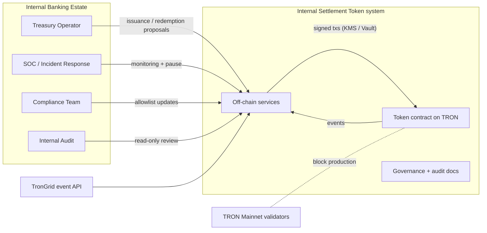
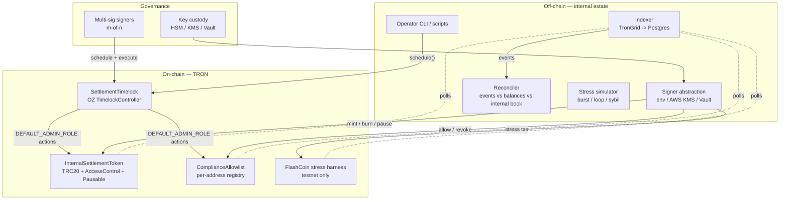
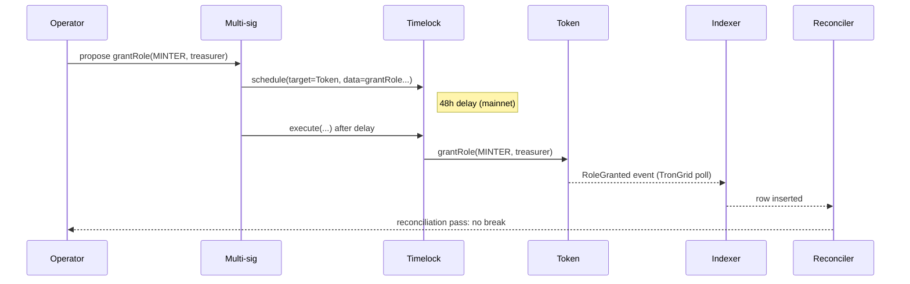

# 01 — System Overview (C4 L1 + L2)

## Purpose

The Internal Settlement Token (IST) infrastructure exists to let Treasury,
Operations, and Risk model tokenised settlement flows on a real public
blockchain (TRON Mainnet) under controlled conditions. The system uses
production primitives — real on-chain execution, multi-sig governance,
HSM-backed signing — but operates within an institutional allowlist so that
it cannot interact with public counterparties or be confused with an
externally-issued asset.

## Out of scope

* Public token sale, exchange listing, secondary-market liquidity.
* Custody of customer funds.
* Integration with Treasury's production ledger (planned in a follow-on
  engagement; out of scope for the initial sandbox).

## C4 Level 1 — System context

## C4 Level 2 — Containers

## Container responsibilities

| Container | Source location | Responsibility |
|---|---|---|
| `InternalSettlementToken` | `contracts/InternalSettlementToken.sol` | TRC20, mint/burn under role gating + cap + rate limit, Pausable. |
| `ComplianceAllowlist` | `contracts/access/ComplianceAllowlist.sol` | Per-address registry consulted on every transfer. |
| `SettlementTimelock` | `contracts/governance/Timelock.sol` | OZ TimelockController; queues every privileged action. |
| FlashCoin stress harness | `contracts/stress/FlashCoin.sol` | Testnet-only abuse counterparty for SOC drills. |
| Signer abstraction | `services/keymanagement/signer.py` | Env / KMS / Vault adapters. Mainnet uses KMS. |
| Indexer | `services/indexer/indexer.py` | Append-only TronGrid event poller into SQL. |
| Reconciler | `services/reconciliation/reconciler.py` | Three-way: events ↔ on-chain balances ↔ internal book. |
| Stress simulator | `services/stress/simulator.py` | Burst / loop / sybil — exercises indexer & SOC alerting. |

## Data flows

The most important property of this system is that **every state-changing
operation produces an on-chain event, and every off-chain check derives from
those events.** The reconciler intentionally does NOT trust the on-chain
`balanceOf()` view as the source of truth — it recomputes balances from the
event stream and asserts equality. A divergence is a reconciliation break.

## Why not a proxy / upgradeable pattern?

We deliberately do NOT use UUPS or a transparent proxy. The audit and
operational reasoning is in [`../security/smart_contract_risks.md`](../security/smart_contract_risks.md#why-no-proxy)
and is summarised: a non-upgradeable contract has a smaller attack surface,
a clearer audit boundary, and matches how USDC and other regulated stable
assets are operated. Bug fixes ship as v2 with a ceremonial mint-on-v2 /
burn-on-v1 migration governed by the multi-sig.
