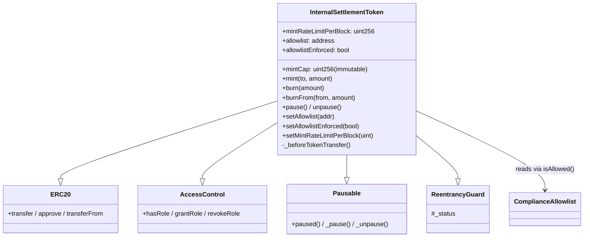
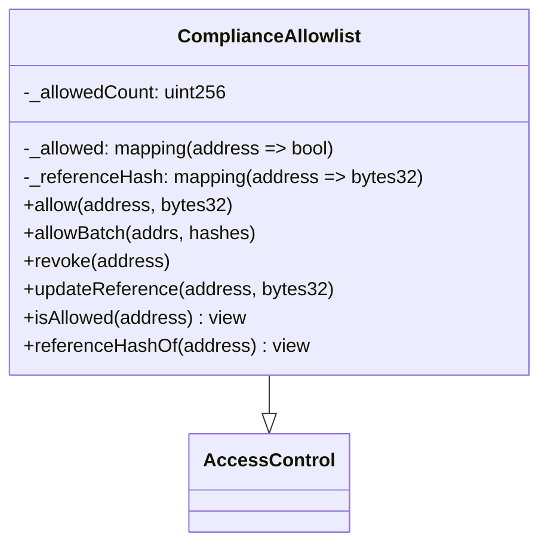
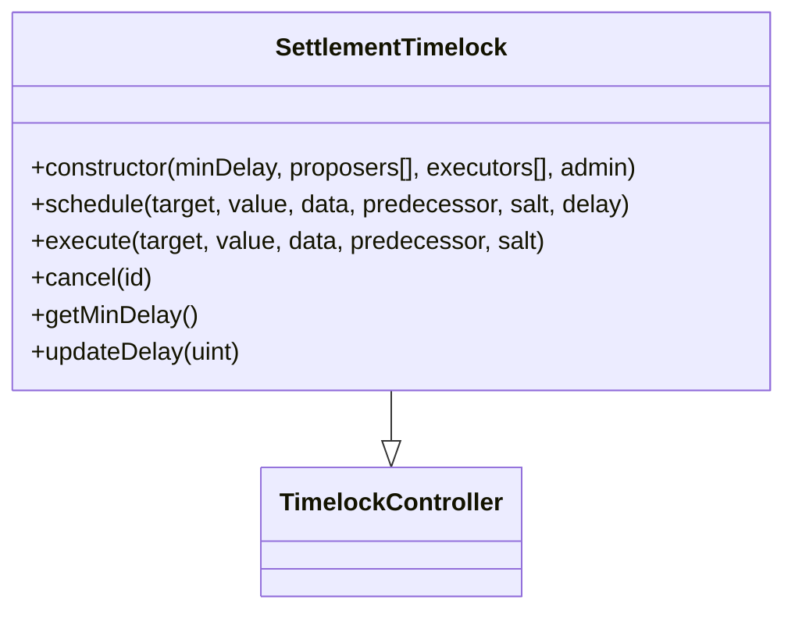
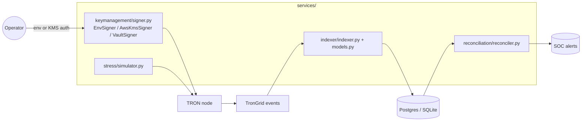
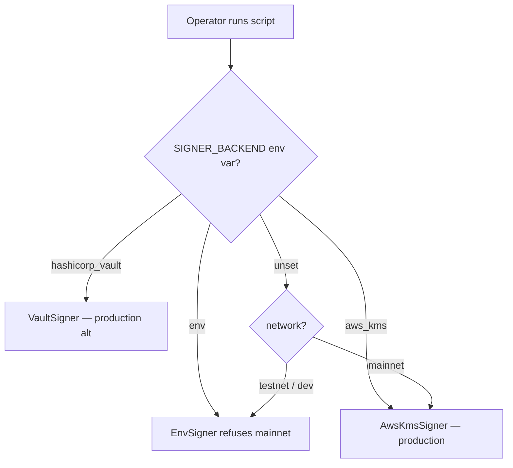

# 02 — Component View (C4 L3)

## InternalSettlementToken — internal structure

### Role -> capability matrix (token contract)

| Role | mint | burn / burnFrom | pause / unpause | grantRole / revokeRole | setAllowlist / setEnforced / setRateLimit |
|---|---|---|---|---|---|
| `DEFAULT_ADMIN_ROLE` (Timelock) |  |  |  | ✓ | ✓ |
| `MINTER_ROLE` | ✓ |  |  |  |  |
| `BURNER_ROLE` |  | ✓ |  |  |  |
| `PAUSER_ROLE` |  |  | ✓ |  |  |
| anyone else |  |  |  |  |  |

The admin can ONLY grant/revoke roles or change non-economic parameters.
The admin **cannot move balances** under any code path — verified by the
test `access.test.js: admin cannot move balances via DEFAULT_ADMIN_ROLE alone`.

## ComplianceAllowlist — internal structure

The reference-hash field is intentionally `bytes32` (a hash) rather than a
string — it stores `keccak256(<off-chain case ID>)`, never PII. The off-chain
compliance system retains the underlying record. This mirrors guidance from
EU and Swiss data-protection regulators that public-blockchain storage of
PII is unacceptable.

## SettlementTimelock — internal structure

* `minDelay` = 1h on testnet, 48h on mainnet.
* `admin` = `address(0)` — the timelock administers itself via queued ops.
  This is the OpenZeppelin "self-administered" pattern and removes the
  super-user override class of bug.

## Off-chain components

### Signer adapter selection

The `EnvSigner` constructor explicitly raises if `network == "mainnet"`,
preventing a developer key from ever signing a mainnet transaction even if
an operator misconfigures `SIGNER_BACKEND`. See
[`../security/key_management_policy.md`](../security/key_management_policy.md).
