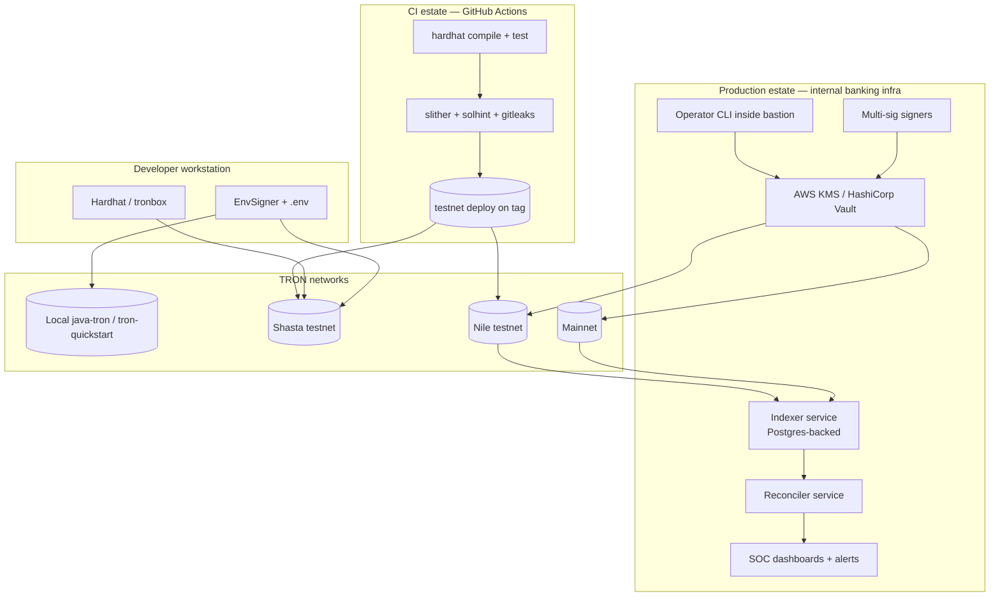

# 03 — Deployment Topology

## Network promotion path

| Stage | Network | Purpose | Signer | Approval needed |
|---|---|---|---|---|
| 1 | local | Developer iteration | EnvSigner / Hardhat default | None |
| 2 | Shasta | CI integration tests, automation | EnvSigner via CI secret | PR merge to main |
| 3 | Nile | Dress rehearsal, multi-sig drill | KMS (testnet key) | Engineering Lead + Security |
| 4 | Mainnet | Production simulation | KMS (mainnet key) | Multi-sig (m-of-n) + Timelock |

A production deploy is gated by completing the
[`../deployment/preflight_checklist.md`](../deployment/preflight_checklist.md).
The promotion from Nile → Mainnet is also recorded in the change-management
ticket; no purely-engineering action triggers a mainnet move.

## Network endpoints

| Network | Full host | Network ID |
|---|---|---|
| development | `http://127.0.0.1:9090` | 9 |
| Shasta | `https://api.shasta.trongrid.io` | 2 |
| Nile | `https://nile.trongrid.io` | 3 |
| Mainnet | `https://api.trongrid.io` | 1 |

Endpoint values live in `tronbox-config.js` and are not configurable per
deploy.
