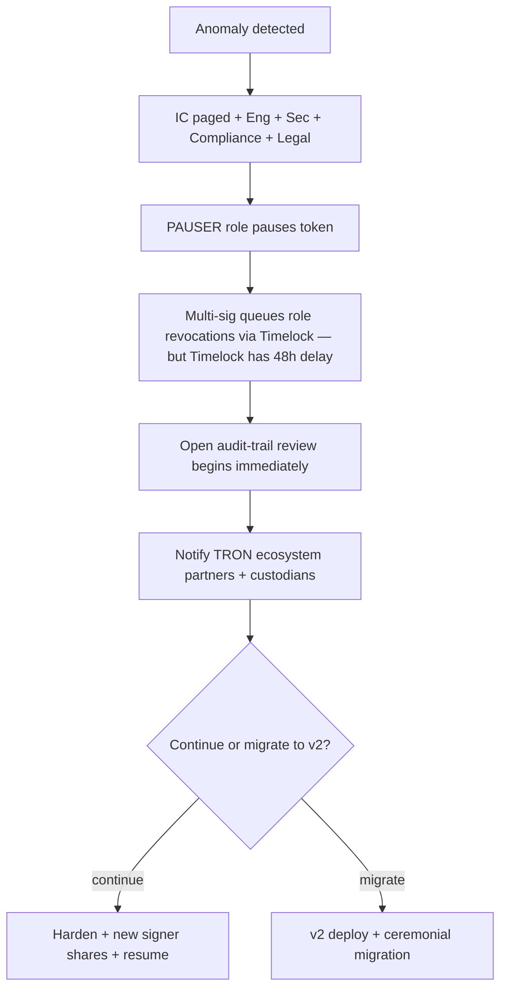

# Incident Response Runbook

Authoritative procedure for security and operational incidents on the IST
infrastructure. Severity classification follows the bank's standard:
SEV-1 (existential) ↓ SEV-4 (cosmetic).

## Roles

| Role | Who | Reachability |
|---|---|---|
| Incident Commander (IC) | SOC on-call lead | PagerDuty / phone |
| Engineering Lead | Eng-Blockchain on-call | Phone |
| Security Lead | InfoSec on-call | Phone |
| Compliance Lead | Compliance Officer | Phone |
| Legal | Legal on-call | Phone |
| Communications | Comms lead | Email / phone |

The IC owns the timeline. Everyone else owns their respective workstream.
No-one acts unilaterally on the smart contracts during an incident — every
on-chain action is a multi-sig + Timelock proposal even under pressure,
unless the system is already paused (in which case the only legitimate
unpause path is the same multi-sig).

## Severity matrix

| Severity | Definition | Examples |
|---|---|---|
| SEV-1 | Multi-sig threshold compromised, or unauthorised supply movement at scale | Mainnet mainnet key share theft + signing observed |
| SEV-2 | Single privileged role key compromised; rate limit blunts blast radius | MINTER_ROLE signer service compromised |
| SEV-3 | Reconciliation break; integrity in question, no observed exploit | Indexer reports event/balance mismatch |
| SEV-4 | Operational degradation, no integrity impact | TronGrid 5xx storm; indexer lag |

## SEV-1: Existential



### SEV-1 first 15 minutes

1. IC opens incident in the bank's incident system; sets channel.
2. PAUSER on-call **pauses** the token (`token.pause()`). Single tx.
3. IC pages: Eng Lead, Sec Lead, Compliance Lead, Legal, Comms.
4. Sec Lead initiates KMS key audit trail export (last 24h).
5. Eng Lead pulls the event stream from the indexer and freezes a
   forensic snapshot.

### SEV-1 first 4 hours

1. Multi-sig **queues** revocation of every operational role on the
   affected contracts via Timelock. The 48h delay is intentional and
   does NOT indicate the system is unprotected — pause already stops
   transfers.
2. Sec Lead runs `services/reconciliation/reconciler.py` against the
   forensic snapshot and produces a divergence report.
3. Compliance Lead reviews the allowlist for unauthorised additions in
   the last 30 days. Any match triggers immediate revocation proposal.
4. Comms Lead drafts internal stakeholder note. Legal reviews.

### SEV-1 decision: continue vs migrate

If the multi-sig is intact and the breach is contained to operational
keys, the system can **resume** after key rotation. If the multi-sig
itself is compromised, the system **migrates to v2** per
`smart_contract_risks.md` §4.

## SEV-2: Operational role key compromise

1. IC paged. PAUSER may pause if blast radius is escalating.
2. Multi-sig queues `revokeRole(<ROLE>, <addr>)` via Timelock.
3. Within the 48h delay window, the rate-limit (mint) or DoS-only
   character (pauser) of the compromised role is the active control.
4. New key generated in KMS. Address derived. Multi-sig queues
   `grantRole` after the revocation matures.

## SEV-3: Reconciliation break

1. Reconciler raises an alert. SOC owns triage.
2. Three-way comparison (events ↔ balance ↔ book) localises the
   divergence. The on-chain event stream is treated as authoritative.
3. If the break is in the internal book (most common), Treasury Ops
   updates the book. If on-chain, escalate to SEV-2.

## SEV-4: TronGrid degradation

1. Indexer falls behind. Alerts fire if lag > 5 minutes.
2. Operator switches indexer to a secondary endpoint.
3. No on-chain action.

## Forensic snapshot procedure

The first thing the SOC does after any SEV-1 / SEV-2 declaration:

```bash
# Copy the indexer DB to a write-protected forensic share.
mkdir -p /forensics/$(date -u +%Y%m%dT%H%M%SZ)
cp services/indexer/indexer.db /forensics/.../indexer.db
chmod 0440 /forensics/.../indexer.db

# Snapshot the on-chain head block — used as the cutoff for replay.
node -e "console.log(require('tronweb').currentBlock())" > /forensics/.../head.json

# Export the KMS audit log.
aws cloudtrail lookup-events --lookup-attributes \
  AttributeKey=ResourceName,AttributeValue=<key-id> \
  > /forensics/.../kms-audit.json
```

## Post-incident

* Within 5 business days: written postmortem with timeline, root cause,
  and corrective actions. Postmortem stored in `docs/security/postmortems/
  <date>-<short-id>.md`.
* Within 10 business days: corrective actions tracked as tickets;
  high-severity actions completed within 30 days.
* This runbook is updated with anything the incident exposed as missing.
